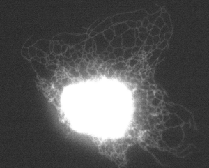
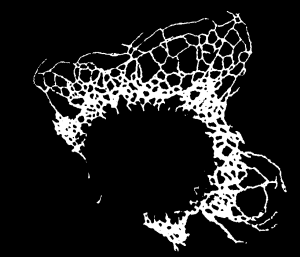

#### *Deprecation*
*This project is superseded by [ERnet-v2](https://github.com/charlesnchr/ERnet-v2) associated with our more recent publication . Please see the new repository for a more advanced segmentation model that leverages a transformer architecture.*

# ERNet — Segmentation of Endoplasmic Reticulum microscopy images
_Meng Lu<sup>1</sup>, Francesca W. van Tartwijk<sup>1</sup>, Julie Qiaojin Lin<sup>1</sup>, Wilco Nijenhuis, Pierre Parutto, Marcus Fantham<sup>1</sup>,  __Charles N. Christensen<sup>1,*</sup>__, Edward  Avezov, Christine E. Holt, Alan Tunnacliffe, David Holcman, Lukas C. Kapitein, Gabriele Kaminski Schierle<sup>1</sup>, Clemens F. Kaminski<sup>1</sup>_</br></br>
<sup>1</sup>University of Cambridge, Department of Chemical Engineering and Biotechnology</br>
<sup> *</sup>Author of this repository - GitHub username: [charlesnchr](http://github.com/charlesnchr) - Email address: <code>charles.n.chr@gmail.com</code>

Pre-print: [https://www.biorxiv.org/content/10.1101/2020.01.15.907444v2](https://www.biorxiv.org/content/10.1101/2020.01.15.907444v2)
<br>
Paper: [https://www.science.org/doi/10.1126/sciadv.abc7209](https://www.science.org/doi/10.1126/sciadv.abc7209)

## Introduction

ERNet is an artificial neural network based model for segmentation of endoplasmic reticulum microscopy images. The network architecture of choice is a deep residual network inspired by EDSR and RCAN ([Lim et al. 2017](https://arxiv.org/abs/1707.02921), [Zhang et al., 2018](https://arxiv.org/abs/1807.02758)). The modified architecture is shown in the image below with a block corresponding to EDSR.


The architectures of these models are among several residual learning networks (cite ResNet, SRGan, EDSR) designed for image restoration, specifically single image super-resolution (SR), i.e. image upsampling. The state-of-the-art SR architectures generally do not use downsampling between layers, but instead make training of deep networks feasible by following the structure of residual networks as first introduced with ResNets intended for image classification. The design idea of residual networks was taken one step further in EDSR with the proposal of a modified residual building block called ResBlock, which was found to be superior to the previously proposed and more directly adapted ResNet model called SRResNet

Choosing the first part of our segmentation model to have an architecture built for restoration ensures that it is capable of handling low signal-to-noise ratio as it can learn to perform denoising in these early layers of its network. A neural network model intended for image restoration will by default perform regression in order to output pixel value predictions in the same colour space as the input image. This is achieved during model training by minimising an appropriate loss function, typically the mean squared error.

## Installation :wrench:

This implementation requires Pytorch. We have tested ERNet with Python 3.6 and 3.7 and Pytorch 1.2 and 1.4.

## Training data :bar_chart:
A simple training data set is provided in `./trainingdata/partitioned_256`. This dataset is preprocessed based on the labelled datafiles in `./trainingdata/labelled_data` using the command:
```powershell
python buildTrainingData.py
```

## Model training :watch:


* Start in the root folder: ```./```
* See available command line options with `python run.py -h`
* An example of options for training with RCAN could be:
  ```powershell
  --root trainingdata/partitioned_256
  --out trained_models/ERNet_rcan-rg5
  --imageSize 256
  --model rcan
  --nch_in 1
  --nch_out 2
  --ntrain 480
  --ntest 20
  --batchSize 2
  --n_resgroups 5
  --n_resblocks 10
  --lr 0.0001
  --scheduler 20,0.5
  --nepoch 100
  --dataset pickledataset
  ```
* Run the `run.py` script with Python, e.g.:
  ```powershell
  python run.py --root trainingdata/partitioned_256 --out trained_models/ERNet_rcan-rg5 --imageSize 256 --model rcan --nch_in 1 --nch_out 2 --ntrain 480 --ntest 20 --batchSize 2 --n_resgroups 5 --n_resblocks 10 --lr 0.0001 --scheduler 20,0.5 --nepoch 100 --dataset pickledataset
  ```

## Testing
A couple of test images of the endoplasmic reticulum are provided in `testdata/input`, for instance:



To evaluate a model on these images in order to get the segmentation maps, use the script `evaluate.py`.

 A simple pretrained model based on the example in the 'Model training' section is in the folder `pretrained_model`.

__Evaluating inputs with a model:__
* Start in the root folder: ```./```
* See available command line options with `python evaluate.py -h`
* An example of applying the pretrained model on the provided test images could be:
  ```powershell
  --root testdata/input
  --weights pretrained_model
  --imageSize 1000
  --out testdata/output
  --model rcan
  --nch_in 1
  --nch_out 2
  --n_resgroups 5
  --n_resblocks 10
  ```
* Run the `evaluate.py` script with Python, e.g.:
  ```powershell
  python evaluate.py --root testdata/input --weights pretrained_model --imageSize 1000 --out testdata/output --model rcan --nch_in 1 --nch_out 2 --n_resgroups 5 --n_resblocks 10
  ```

The above example generates the output in `testdata/output`, such as:

 
